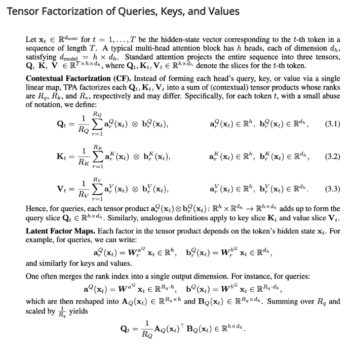

# TPA (Tensor Product Attention)

A PyTorch implementation of Tensor Product Attention from the [T6 paper](https://arxiv.org/abs/2501.06425) - "Tensor Product Attention Is All You Need".



Please refer to their [homepage](https://tensorgi.github.io/T6/) for more information.

## Benefits of TPA

- **10x Smaller KV Cache**: Drastically reduces memory requirements during inference through tensor decomposition
- **Improved Model Quality**: Achieves better perplexity compared to standard attention mechanisms (MHA, MQA, GQA, MLA)
- **RoPE Compatible**: Works with rotary positional embeddings out of the box
- **Unified Framework**: Naturally encompasses MHA, MQA, and GQA as special cases

## Requirements

- Python ≥ 3.12
- PyTorch (nightly build with CUDA 12.4)

## Installation

```bash
git clone https://github.com/Greg-Tarr/tpa.git
cd tpa
uv run tpa.py
```

## Usage

```python
from tpa import TPAttention

# Initialize the attention module
model = TPAttention(
    d_model=8192,    # Model dimension
    n_head=64,       # Number of attention heads
    r_Q=1,           # Q factor rank
    r_K=1,           # K factor rank
    r_V=1,           # V factor rank
).cuda().bfloat16()

# Forward pass
output, kv_cache = model(input_tensor)

# Subsequent passes with KV cache
next_output, kv_cache = model(next_input, kv_cache)
```

## Performance

On an NVIDIA RTX 4090, single layer.
- Prefill: ~332k tokens/second
- Generation with KV cache: ~554 tokens/second
- 6x speedup using KV cache vs. no cache

## Citation

If you use Tensor Product Attention (TPA) or the Tensor ProducT ATTenTion Transformer (T6) in your research or application, please consider citing the original authors!

```bibtex
@article{zhang2025tensor,
    title={Tensor Product Attention Is All You Need},
    author={Zhang, Yifan and Liu, Yifeng and Yuan, Huizhuo and Qin, Zhen and Yuan, Yang and Gu, Quanquan and Yao, Andrew Chi-Chih},
    journal={arXiv preprint arXiv:2501.06425},
    year={2025},
}
```
